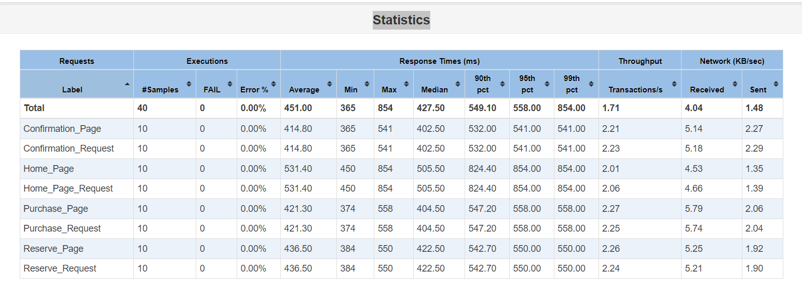

# JMeter Performance Testing for BlazeDemo

## Overview
This project demonstrates how to conduct performance testing using Apache JMeter on the BlazeDemo application. 

The objective is to simulate user behavior, analyze performance metrics, and generate comprehensive reports.

## Technologies Used
- **Apache JMeter**: A widely used tool for load testing and performance measurement.
- **Java**: Required to run JMeter.
- **GitHub Actions**: For continuous integration and deployment (CI/CD).

## Setup Instructions
1. Clone this repository:
   ```bash
   git clone https://github.com/harsha123e/JMeter-BlazeDemo-Test.git
   cd JMeter-BlazeDemo-Test
   ```
2. Install [Apache JMeter](https://jmeter.apache.org/) and [Java](https://www.oracle.com/java/technologies/javase-jdk11-downloads.html) if you haven't already done so.
3. Open the JMeter GUI by navigating to the extracted JMeter directory, going to the `bin` folder, and launching the `jmeter.bat` file (on Windows) or `jmeter` (on Unix-based systems).
4. Open the test plan file named `BlazeDemo_Test_Plan.jmx` within the JMeter GUI.

## Test Scenarios
This project focuses on simulating a realistic user journey on the BlazeDemo website. The end-to-end test case encompasses the following key actions:

1. **Homepage Access**: Simulate user visits to the homepage to assess the initial load time.
2. **Flight Selection**: Users select departure and arrival cities for their flights, interacting with dropdown menus.
3. **Flight Booking**: After selecting a flight, users fill in the required details, including personal information and payment options, to book their tickets.
4. **Confirmation Screen**: Upon successful booking, users are directed to a confirmation screen, which serves as the final step in the booking process.

Each step includes think time to replicate a realistic user experience, accounting for the pauses users would typically take while interacting with the site.

## How to Run the Tests
1. Open a terminal and navigate to the `jmeter/bin` directory.
2. Execute the following command to run the tests and generate reports:
   ```bash
   ./jmeter -n -t "../test-plan/BlazeDemo_Test_Plan.jmx" -l "../results/results.csv" -e -o "../results/Reports"
   ```
- **Note**: The `results` folder must be pre-created; otherwise, the command will not execute successfully.

## Results
The performance results are stored in the `results` directory and include:
- **CSV File**: Raw performance data detailing response times, error rates, and other metrics.
- **HTML Reports**: A visual representation of the test results, showcasing key performance indicators such as response times and throughput.
Note: These results are not included in the repository; they can be dynamically generated by running the project.

## GitHub Actions
This project is integrated with GitHub Actions for continuous integration. The tests will automatically run on every push or pull request, and the results will be uploaded as artifacts for review.

## Sample Performance Metrics
Sample performance metrics screenshots from the HTML Report.

### Statistics
Displays key metrics such as total requests, error rates, and average response times, providing a comprehensive overview of the application's performance during the test.



### Response Time Overview
Shows the average, minimum, and maximum response times, giving a clear view of overall system responsiveness under load.


### Response Time Percentiles
Indicates how quickly the top 90%, 95%, and 99% of requests are handled, offering insights into performance for most users.

